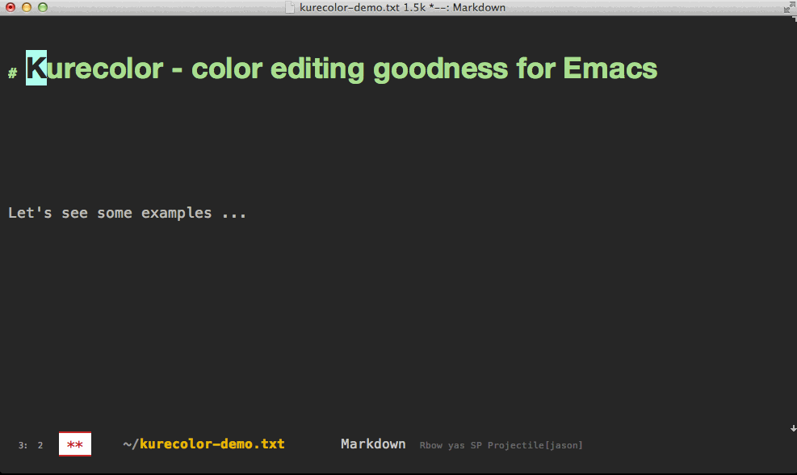

# kurecolor - color editing goodies for Emacs

A collection of color tools aimed at those working with (normal 6
digit) hex color codes, useful for CSS, Emacs themes, etc. etc.

# The functions...

### `kurecolor-adjust-brightness`

Adjust the HEX color brightness by AMOUNT 0.0-0.1.

### `kurecolor-adjust-hue`

Adjust the HEX color hue by AMOUNT 0.0-0.1.

### `kurecolor-adjust-saturation`

Adjust the HEX color saturation by AMOUNT 0.0-0.1.

### `kurecolor-cssrgb-at-point-or-region-to-hex`

CSS rgb color at point or region to hex rgb.

### `kurecolor-cssrgb-to-hex`

Convert a CSSRGB (or rgba) color to hex (alpha value is ignored).

### `kurecolor-hex-get-brightness`

Get the brightness of HEX color.

### `kurecolor-hex-get-hue`

Get the hue of HEX color.

### `kurecolor-hex-get-saturation`

Get the saturation of HEX color.

### `kurecolor-hex-hue-group`

Given a HEX color.
Insert a list of hexcolors of different hue.

### `kurecolor-hex-sat-group`

Given a HEX color.
Insert a list of hexcolors of different saturation (sat).

### `kurecolor-hex-set-brightness`

Change a HEX color's brightness VAL, amount values from 0.0-1.0.
returns a 6 digit hex color.

### `kurecolor-hex-set-hue`

Change a HEX color's HUE, amount values from 0-1.
returns a 6 digit hex color.

### `kurecolor-hex-set-saturation`

Change a HEX color's saturation SAT, amount values from 0-1.
returns a 6 digit hex color.

### `kurecolor-hex-to-cssrgb`

Convert a HEX rgb color to cssrgb.

### `kurecolor-hex-to-cssrgba`

Convert a HEX rgb color to css rgba (only with 1.0 alpha).

### `kurecolor-hex-to-hsv`

Convert a 6 digit HEX color to h s v.

### `kurecolor-hex-to-rgb`

Convert a 6 digit HEX color to r g b.

### `kurecolor-hex-val-group`

Given a HEX color.
Insert a list of hexcolors of different brightness (val).

### `kurecolor-hexcolor-at-point-or-region-to-css-rgb`

Hex rgb color at point or region to css rgb color.

### `kurecolor-hexcolor-at-point-or-region-to-css-rgba`

Hex rgb color at point or region to css rgba.
Opacity is always set to 1.0.

### `kurecolor-hsv-to-hex`

Convert H S V to a 6 digit HEX color.

### `kurecolor-hsv-to-rgb`

Convert hsv (H S V) to red green blue.
Note: args H S V are expected to be a values from 0..1

### `kurecolor-increase-brightness-by-step`

Increase brightness on hex color at point (or in region) by step.
Accepts universal argument (X).

### `kurecolor-increase-hue-by-step`

Increase hue on hex color at point (or in region) by step.
Accepts universal argument (X).

### `kurecolor-increase-saturation-by-step`

Increase saturation on hex color at point (or in region) by step.
Accepts universal argument (X).

### `kurecolor-decrease-brightness-by-step`

Decrease brightness on hex color at point (or in region) by step.
Accepts universal argument (X).

### `kurecolor-decrease-hue-by-step`

Decrease hue on hex color at point (or in region) by step.
Accepts universal argument (X).

### `kurecolor-decrease-saturation-by-step`

Decrease saturation on hex color at point (or in region) by step.
Accepts universal argument (X).

### `kurecolor-interpolate`

Interpolate two hex colors COLOR1 and COLOR2, to get their mixed color.

### `kurecolor-replace-current`

Get the current unspaced string at point.
Replace with the return value of the function FN with ARGS

### `kurecolor-rgb-to-hex`

Replacement simple RGB to hex.

### `kurecolor-rgb-to-hsv`

Convert RGB, a list of (r g b) to list (h s v).
For this module, h is returned as [0-1] instead of [0-360].

### `kurecolor-set-brightness`

Interactively change a COLOR's BRIGHTNESS.

### `kurecolor-set-hue`

Interactively change a COLOR's HUE.

### `kurecolor-set-saturation`

Interactively change a COLOR's SATURATION.

### `kurecolor-to-8bit`

Convert N (0.0-1.0) to 0-255.

### `kurecolor-xcode-color-literal-at-point-or-region-to-hex-rgb`

XCode color literal at point to hex rgb.

### `kurecolor-xcode-color-literal-at-point-or-region-to-hex-rgba`

XCode color literal at point to hex rgba.

### `kurecolor-xcode-color-literal-to-hex-rgb`

Convert an XCode COLOR-LITERAL to a hex rgb string.

### `kurecolor-xcode-color-literal-to-hex-rgba`

Convert an XCode COLOR-LITERAL to a hex rgba string.

View the presentation at https://github.com/emacsfodder/kurecolor

Features include interactive step modification of hue, sat, val on
hex colors.  Color conversion algorithms, for 6 digit hex colors,
hsv, rgb, cssrgb.  Get/set h s v values from/for a color.

It's recommend you use this in conjunction with rainbow-mode, for
instant feedback on color changes.

### Doing cool things

You can do funky things like adjust the saturation of all the
colors in a selection, using macros.

The presentation touches on this, and you'll need to get your
keyboard macro skills out to really shine, but it's relatively
simple.

### Step by step: Mass saturation decrease
As per the animated presentation, these steps will demonstrate how to
use Kurecolor interactive hsv adjusters with keyboard macros, to mass
adjust colors.

Add a few hex colors to your active buffer, or load up a css, code or
simple text buffer, which already has some colors you'd like to tweak.
Activate rainbow-mode.  (If you need to install rainbow-mode, grab it
from ELPA.)

After you have some colors ready to tweak, we're ready to try the
following steps:

1. Select the region you want to modify
2. Narrow the buffer `M-x narrow-to-region`
3. Go to the top `M-<` of the narrowed section
4. Start recording a macro `f3`
  1. Regexp i-search `C-M-s` for `#[0-9A-Fa-f]\{6\}` and `ENTER` on the first match
  2. Your cursor point will be at the end of the first color (unless the Regexp was in-adequate :( )
  3. `M-5` (to do 5 steps) `M-x kurecolor-decrease-saturation-by-step` (shortcut `M-x kure-d-sat` **TAB**)
5. Stop recording the macro `f4`
6. Run the macro again with `f4`, repeat until you are finished, or use `M-0 f4` to run the macro until it hits the end of the narrowed region (or hits an error).
8. When you're done, `M-x widen` to exit narrowing.

## Installing

Installing kurecolor is recommended to be done via MELPA.

    M-x package-install kurecolor

If you wish to install it manually, you already have your big boy
pants on and need no further help from me.

Enjoy!

### Tests

This package has a suite of unit tests.  To run them load both
kurecolor and kurecolor-test, and then do `M-x ert` (accept
`default`).

### Ephemera

For those interested in such things, the name Kurecolor is
unashamedly nicked from a high end marker pen company.  Hopefully
this outrage will fall silently under their radar, and I won't have
to change it due to some frivilous and paranoid law
suit. (seriously guys, this is just free advertising.)

I have not been pressured into saying this, however, Kurecolor
markers and art supplies are best best!  Buy some NOW (Like REALLY
Immediately!!) for you, your mum and your pet chinchilla Frank.

Since the question comes up occassionally, the mode-line hack used
in the presentation is based on original work by Armit Patel. I
gisted this a while back, you can get it from.
https://gist.github.com/jasonm23/8554119

The theme is Gruvbox, although you can't see much of it. Anyway,
it's a great theme, you should go install it now. (from MELPA)

Package-Requires: ((emacs "24.1") (s "1.0"))

Licence:
 GNU / GPL2

---
Converted from `kurecolor.el` by [*el2markdown*](https://github.com/Lindydancer/el2markdown).
